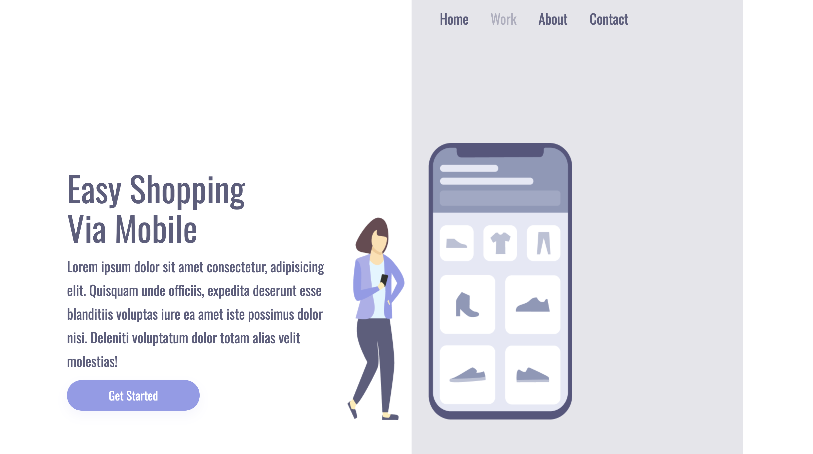

<h1 align="center">Easy Shopping</h1>

 
<h2 align="center">Primeiro projeto publicado feito no DevClub</h2>
   

Venho me dedicando todas as noites para começar a finalmente ser um desenvolvedor front end, então é um projeto incial pequeno mas sei que vem muito mais pela frente! Espero que gostem.

 

Essa é a imagem vendo a partir de um Computador.

 

 

Essa é a imagem vendo a partir de um celular, houve muitas mudanças na tela visual pelo tamanho do dispositivo, com isso há alterações também no código CSS que vou mostrar logo abaixo pra vocês!

 

 

Essa é a imagem dos cógidos criados em HTML, sei que parece um monte de letras doidas, mas TODOS os sites que você navega são criados assim.

 

 

Esses são os códigos em CSS na estilização adaptado para mobile, achei bem interessante essa parte, por isso decidi colocar somente ela demonstrando algumas poucas alterções do comando todo.

